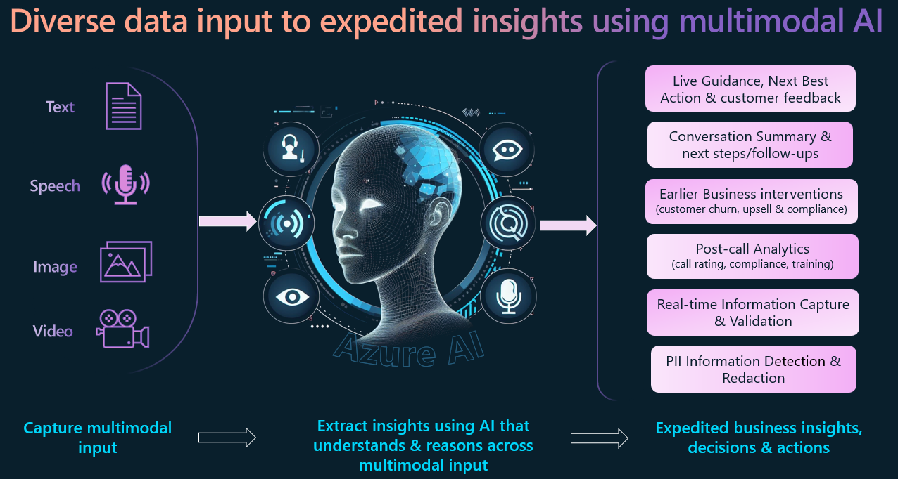
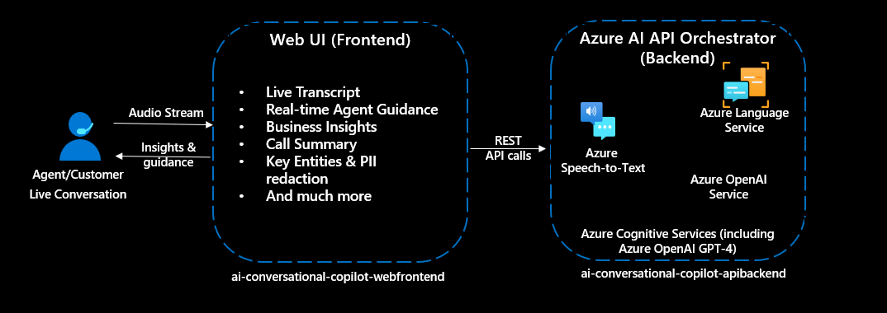
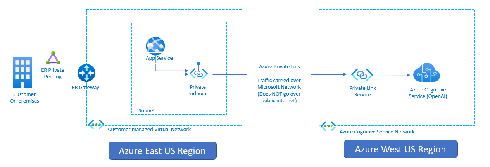

# Conversation Copilot with Multimodal Azure AI
Conversation copilot is a web-based app that enables you to simulate Agent-Customer interactions (in any line of business) and shows the power of AI to act as a very effective copilot. It uses Azure AI’s powerful multimodal understanding of long-form text, images and ability to reason across the diverse data input to power the copilot experience.

**Solution highlights:**
* A pattern for customer interaction where it intercepts voice, text and image data in real-time to power a better and more efficient end-user experience.
* The real-time pattern implemented here can be applied to expedite business insights & make faster business decisions.
    * Drive earlier actions: for example customer churn & upsell opportunities.
    * Live guidance to enable agent-assist, coaching and virtual agents use cases.
* Pattern could be used to drive better digital experiences for customers/employees
    * Could be used to mobile/web experiences (not just call centers).

**Key features of this solution:**
1. **Live Guidance**: Real-time conversation analysis to provide live guidance.
2. **GPT-Vision for image analysis**: Extract key information & insights from images.
3. **Conversation Summarization & custom insight**: Extract custom business insights & conversation summarization.
4. **Conversation Transcript**: Transcription of live audio stream (using laptop mic or headphone).
5. **Entity Extraction & PII Detection** including real-time PII redaction.

## Architecture
Below architecture diagram shows the key components of this solution. 

The solution has two runtime components: 
* **API backend** is an Express-based backend API app. It orchestrates calls to multiple Azure AI services (Azure OpenAI, Azure Speech, Azure Language) and provides API endpoint for the frontend webapp to consume.

* **Web frontend** is a React-based web UI. It captures voice, text, image data and interacts with the backend API to get real-time insights from Azure AI services.

## Prerequisites

1. This article assumes that you have an Azure account. If you don't have an Azure account and subscription, [try the Azure account for free](https://azure.microsoft.com/en-us/free/search/).
2. Create a [Azure Speech resource](https://portal.azure.com/#create/Microsoft.CognitiveServicesSpeechServices) in the Azure portal.
3. Create a [Azure Language resource](https://portal.azure.com/#create/Microsoft.CognitiveServicesTextAnalytics) in the Azure portal.
4. Create a [Azure OpenAI resource](https://portal.azure.com/?microsoft_azure_marketplace_ItemHideKey=microsoft_openai_tip#create/Microsoft.CognitiveServicesOpenAI?WT.mc_id=academic-84928-cacaste) in the Azure portal. You can check the [OpenAI documentation](https://docs.microsoft.com/en-us/azure/cognitive-services/openai/overview?WT.mc_id=academic-84928-cacaste) for more information. This app is using Azure OpenAI Completion API, Chat API & GPT-4 Vision. So you will need to create model deployments for completion API, Chat API and GPT-4 Vision.
5. Install [Node.js](https://nodejs.org/en/download/) on your laptop to run the frontend and backend apps on your local machine.

## How to setup this solution

1. Clone this repo. This repo has two apps: 
    * ai-conversational-copilot-webfrontend folder is for the "ReactJS Frontend" web UI component and
    * ai-conversational-copilot-apibackend folder is for the "ExpressJS Backend" API backend component 

2. **Prepare and run the backend app (in folder ai-conversational-copilot-apibackend)**
    -	Go to ai-conversational-copilot-apibackend directory and run `npm install -all` to install dependencies.
    -   Rename config_template.json to config.json
    -	Update the “config.json” file with your Azure Speech service key (speech_subscription_key property) and Azure region (speech_region property). Azure Region value examples: “eastus2”, “westus”
    -	Update the “config.json” file with your Azure Language service key (text_analytics_key property) and endpoint (text_analytics_endpoint property). 
    -	Update the “config.json” file with your Azure OpenAI service key (openai_key property), endpoint (openai_endpoint property) and deployment name (openai_deployment_name property). These settings are associated with OpenAI completion API.
    -	Update the “config.json” file with your Azure OpenAI service Chat API model deployment information. NOTE: Chat API is used for live guidance functionality. So if you do not enable "Live Guidance" from the web UI settings then you do not need to configure Chat API settings in this config.json file.
    -  Update the “config.json” file with your Azure OpenAI service GPT-4 Vision model deployment information. NOTE: GPT-4 Vision is used for image analysis functionality. So if you do not enable "GPT-Vision" from the web UI settings then you do not need to configure "gptv_key" & "gptv_endpoint" settings in this config.json file. 
    - Also, Azure storage is only used for image analysis. So if you do not enable "GPT-Vision" from the web UI settings then you do not need to configure "azure_storage_account_name", "azure_storage_connection_string" & "azure_storage_container_name" settings in this config.json file.
    -   Start backend AI API app by running `‘npm start’`
    -	If you are running this locally then try accessing below URLs from browser to verify that the backend component is working as expected
        *	`http://localhost:8080/api/sayhello`
        *	`http://localhost:8080/api/get-speech-token`
    -	If you have deployed ai-app-backend app to Azure App Service (as per instructions below) then you can verify using URLs from browser as below:
        *	`https://<<your backend Azure App service name>>/api/sayhello`
        *	`https://<<your backend Azure App service name>>/api/get-speech-token`
3.	**Prepare and run the frontend app for web UI (in folder ai-conversational-copilot-webfrontend)**
    +	Go to ai-conversational-copilot-webfrontend directory and run `npm install -all` to install dependencies.
    +	Update “src/main.tsx” as following. Set value of “axios.defaults.baseURL” depending on where your ai-conversational-copilot-apibackend is running. You might have to update the port number as well depending on where you are running the backend app.
        +	If “ai-conversational-copilot-apibackend” is running on local machine using port 8080 then use `axios.defaults.baseURL = 'http://localhost:8080';`
    +   Start frontend web app by running `‘npm run dev’`. If you get port confict with port 8080 then update package.json file to use any other port (Eg: 8081)
    +	Open a browser and go to `http://localhost:8081` to access the app. 
    +   Click on the "Start Converstation" button on the web page and start talking. You should see transcription displayed on the web page in real-time (an example shown below). You can change spoken language under "Settings". Note that Live Guidance is disabled by default. Output below is with Live Guidance enabled.
    +   Remember to click on "End Conversation" to stop live transcription and insights.

    

## Selecting AI Features to use
This solution is modular and you can select which AI features you want to use. You can enable/disable AI features from the web UI settings. Below are the AI features that you can enable/disable from the web UI settings.
1. **Live Guidance**: This feature uses Azure OpenAI Chat API (GPT-4) to provide live guidance to the agent. This feature is disabled by default. To enable this feature, go to "Settings" and then enable "Live Guidance". You can update the conversation template as necessary and can also tune the template questions/wordings. An example of live guidance configuratio is shown below.

    

2. **GPT-Vision**: This feature uses Azure OpenAI GPT-4 Vision to extract key information from images. This feature is disabled by default. To enable this feature, go to "Settings" and then enable "GPT-Vision". An example of GPT-Vision output is shown below.

    

3. **Conversation Summarization & custom prompts**: This feature uses Azure OpenAI Completion API to summarize the conversation or extract insights using custom prompts. This feature is disabled by default. To enable this feature, go to "Settings" and then enable "Custom Prompts". An example of conversation summarization output is shown below.

    

4. **Conversation Transcript**: This feature uses Azure AI Speech service to perform real-time transcription of the conversation. This feature is enabled by default and can not be disabled. To hide real-time conversation transcript, go to "Settings" and then disable "Live Transcription". This will only hide the transcript from the web UI. The transcript will still be available in the backend API and can be used for other AI features.

5. **Entity Extraction & PII Detection**: This feature uses Azure AI Language Service to extract entities and detect PII information. This feature is enabled by default and can not be disabled. To hide this information, go to "Settings" and then disable "Live Transcription". 

## Using Azure OpenAI Service via Private Link from a different region
Azure OpenAI Service is powered by a diverse set of models with different capabilities and price points. Model availability [varies by region](https://learn.microsoft.com/en-us/azure/ai-services/openai/concepts/models).

You can consume Azure OpenAI service from a different region using private link ensuring the traffic traverses the Microsoft backbone network. This will ensure that the traffic is secure and does not traverse the public internet. You can follow the architecture below to setup private link for Azure OpenAI service. The private-link resource can be deployed in a different region than the one for the virtual network and private endpoint - more details [here](https://learn.microsoft.com/en-us/azure/private-link/private-endpoint-overview).

## License
Copyright (c) Microsoft Corporation

All rights reserved.

MIT License

Permission is hereby granted, free of charge, to any person obtaining a copy of this software and associated documentation files (the ""Software""), to deal in the Software without restriction, including without limitation the rights to use, copy, modify, merge, publish, distribute, sublicense, and/or sell copies of the Software, and to permit persons to whom the Software is furnished to do so, subject to the following conditions:

The above copyright notice and this permission notice shall be included in all copies or substantial portions of the Software.

THE SOFTWARE IS PROVIDED AS IS, WITHOUT WARRANTY OF ANY KIND, EXPRESS OR IMPLIED, INCLUDING BUT NOT LIMITED TO THE WARRANTIES OF MERCHANTABILITY, FITNESS FOR A PARTICULAR PURPOSE AND NONINFRINGEMENT. IN NO EVENT SHALL THE AUTHORS OR COPYRIGHT HOLDERS BE LIABLE FOR ANY CLAIM, DAMAGES OR OTHER LIABILITY, WHETHER IN AN ACTION OF CONTRACT, TORT OR OTHERWISE, ARISING FROM, OUT OF OR IN CONNECTION WITH THE SOFTWARE OR THE USE OR OTHER DEALINGS IN THE SOFTWARE

## Contributing

This project welcomes contributions and suggestions.  Most contributions require you to agree to a
Contributor License Agreement (CLA) declaring that you have the right to, and actually do, grant us
the rights to use your contribution. For details, visit https://cla.opensource.microsoft.com.

When you submit a pull request, a CLA bot will automatically determine whether you need to provide
a CLA and decorate the PR appropriately (e.g., status check, comment). Simply follow the instructions
provided by the bot. You will only need to do this once across all repos using our CLA.

This project has adopted the [Microsoft Open Source Code of Conduct](https://opensource.microsoft.com/codeofconduct/).
For more information see the [Code of Conduct FAQ](https://opensource.microsoft.com/codeofconduct/faq/) or
contact [opencode@microsoft.com](mailto:opencode@microsoft.com) with any additional questions or comments.

## Trademarks

This project may contain trademarks or logos for projects, products, or services. Authorized use of Microsoft trademarks or logos is subject to and must follow 
[Microsoft's Trademark & Brand Guidelines](https://www.microsoft.com/en-us/legal/intellectualproperty/trademarks/usage/general).
Use of Microsoft trademarks or logos in modified versions of this project must not cause confusion or imply Microsoft sponsorship.
Any use of third-party trademarks or logos are subject to those third-party's policies.

## DISCLAIMER

This presentation, demonstration, and demonstration model are for informational purposes only and (1) are not subject to SOC 1 and SOC 2 compliance audits, and (2) are not designed, intended or made available as a medical device(s) or as a substitute for professional medical advice, diagnosis, treatment or judgment. Microsoft makes no warranties, express or implied, in this presentation, demonstration, and demonstration model. Nothing in this presentation, demonstration, or demonstration model modifies any of the terms and conditions of Microsoft’s written and signed agreements. This is not an offer and applicable terms and the information provided are subject to revision and may be changed at any time by Microsoft.

This presentation, demonstration, and demonstration model do not give you or your organization any license to any patents, trademarks, copyrights, or other intellectual property covering the subject matter in this presentation, demonstration, and demonstration model.

The information contained in this presentation, demonstration and demonstration model represents the current view of Microsoft on the issues discussed as of the date of presentation and/or demonstration, for the duration of your access to the demonstration model. Because Microsoft must respond to changing market conditions, it should not be interpreted to be a commitment on the part of Microsoft, and Microsoft cannot guarantee the accuracy of any information presented after the date of presentation and/or demonstration and for the duration of your access to the demonstration model.

No Microsoft technology, nor any of its component technologies, including the demonstration model, is intended or made available as a substitute for the professional advice, opinion, or judgment of (1) a certified financial services professional, or (2) a certified medical professional. Partners or customers are responsible for ensuring the regulatory compliance of any solution they build using Microsoft technologies.
